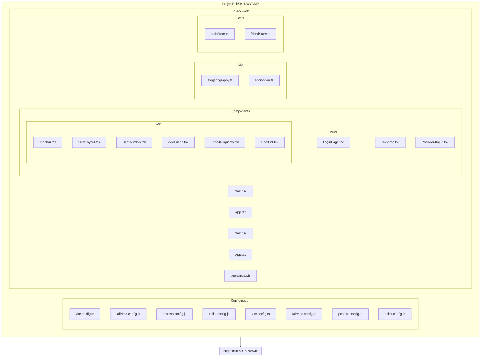

    

    <b>Automatic Architecture Diagrams from Code</b> 
    <a href="https://github.com/swark-io/swark">GitHub</a> • <a href="https://swark.io">Website</a> • <a href="mailto:contact@swark.io">Contact Us</a>

## Usage Instructions

1. **Render the Diagram**: Use the links below to open it in Mermaid Live Editor, or install the [Mermaid Support](https://marketplace.visualstudio.com/items?itemName=bierner.markdown-mermaid) extension.
2. **Recommended Model**: If available for you, use `claude-3.5-sonnet` [language model](vscode://settings/swark.languageModel). It can process more files and generates better diagrams.
3. **Iterate for Best Results**: Language models are non-deterministic. Generate the diagram multiple times and choose the best result.

## Generated Content
**Model**: GPT-4o - [Change Model](vscode://settings/swark.languageModel)  
**Mermaid Live Editor**: [View](https://mermaid.live/view#pako:eNq1VU1v2zAM_SuBzm2H-rBDDgPSpgNWuIMxZ8uGegfFYmwVtuRJ8hKj6H8fZcdxNX-k7TBdTErvkSL1JD-SWDIgcxKJRNEina2WkZjh0OWmmQiUfIDYXMnMhFeXy_WP5V3QQBzYtRRbnpSKGi5Ft27HN26gWb68j8hv9C7i2r0wOiI_XfCK8mzHBesI5jDTkh76pEBqcx2GHafAiVjrCcpN6HNhOgboDP0RAgg2UHIoSxVjZQzc0HeUi1X43UbN0cQq9730i6I4QNAaRDzrbF5IAQKb5QDqbsHeLBRQjNOag8HqJlGtd1KxT6IoDRIcf5DllO3syeebfoLQQEKFrBEVJtDP_aGzrs9BxKoqrGjsIRydIbiznaNTG5OafR98Xt_evFWz3ms1671Bs96rNev9F816pzXr_atmj6BFadL-sh2-TLgIaAKY62iPCrsnU3crKTXDWULOYEMV5jhYoxnssHF8Wsn67nTOSc4aZSB3B07jTHIWjH1UHGuyfW7tSUYD-QK_StBGI82dmOR-1aB8rm1NrfnyPo-_D6GRCvoR7InXS5iOtvbYy9BU0cK3nXfybajvZFWA7YWx33fYdtj_zRt6Qob-drPz8w8jTwo5IzkovDEMf6GPmC2FHCIyn0WEwZaWmYnIE4LKglEDS06xPTmZG1XCme2ADCsRt76SZZKS-ZZmGp7-AH4pNWQ) | [Edit](https://mermaid.live/edit#pako:eNq1VU1v2zAM_SuBzm2H-rBDDgPSpgNWuIMxZ8uGegfFYmwVtuRJ8hKj6H8fZcdxNX-k7TBdTErvkSL1JD-SWDIgcxKJRNEina2WkZjh0OWmmQiUfIDYXMnMhFeXy_WP5V3QQBzYtRRbnpSKGi5Ft27HN26gWb68j8hv9C7i2r0wOiI_XfCK8mzHBesI5jDTkh76pEBqcx2GHafAiVjrCcpN6HNhOgboDP0RAgg2UHIoSxVjZQzc0HeUi1X43UbN0cQq9730i6I4QNAaRDzrbF5IAQKb5QDqbsHeLBRQjNOag8HqJlGtd1KxT6IoDRIcf5DllO3syeebfoLQQEKFrBEVJtDP_aGzrs9BxKoqrGjsIRydIbiznaNTG5OafR98Xt_evFWz3ms1671Bs96rNev9F816pzXr_atmj6BFadL-sh2-TLgIaAKY62iPCrsnU3crKTXDWULOYEMV5jhYoxnssHF8Wsn67nTOSc4aZSB3B07jTHIWjH1UHGuyfW7tSUYD-QK_StBGI82dmOR-1aB8rm1NrfnyPo-_D6GRCvoR7InXS5iOtvbYy9BU0cK3nXfybajvZFWA7YWx33fYdtj_zRt6Qob-drPz8w8jTwo5IzkovDEMf6GPmC2FHCIyn0WEwZaWmYnIE4LKglEDS06xPTmZG1XCme2ADCsRt76SZZKS-ZZmGp7-AH4pNWQ)

